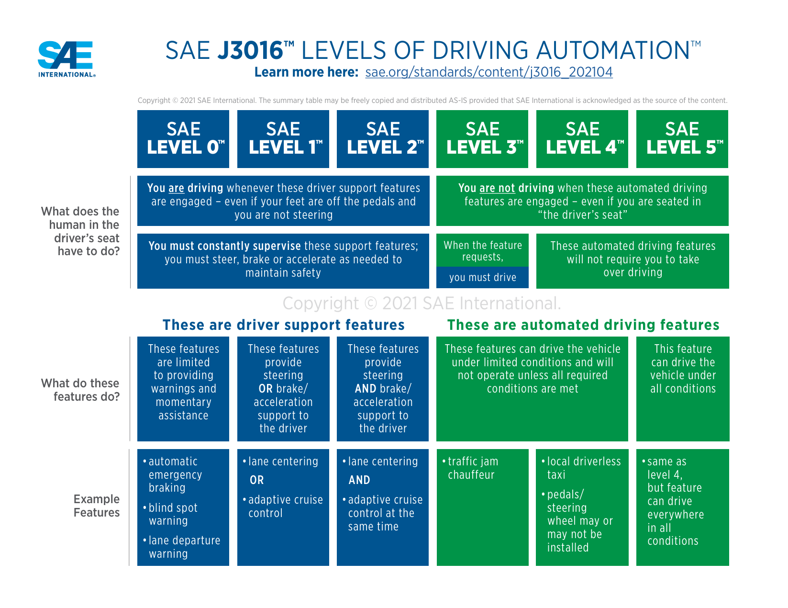

## The dangerous middle

The SAE defined [six levels of driving automation][sae-chart] in 2014. Look closely at the scale and you'll find a
phase change buried in the middle.

_Source: [SAE International J3016](https://www.sae.org/blog/sae-j3016-update)_

At Levels 0 through 2, the human drives. The system helps with lane keeping and adaptive cruise, but the human
performs tasks and monitors the environment. At Level 3, the system performs tasks and the human is expected to be
available as a fallback and ready to intervene. The levels are numbered sequentially, but the transition from 2 to 3 is
not incremental: who is responsible for what just flipped, and over a decade of automotive safety research since the
standard's introduction has shown that this middle zone, where the system is capable enough to disengage the human but
not capable enough to be safe alone, is where the worst outcomes concentrate.

AI coding agents crossed from Level 2 to Level 3 in late 2025.

Level 2 was autocomplete. Copilot suggested the next line, the developer accepted or rejected, and the human was always
in control. Level 3 is agents that run shell commands, make network requests, edit files across repositories, and
orchestrate multi-step workflows. The agent performs the task. The developer reviews. Sometimes. Projects like
[OpenClaw][openclaw] are already building toward agents that don't ask for review at all.

When agents went from suggesting code to executing it, the environment didn't noticeably change. Same terminal,
filesystem, credentials, and network. The autonomy level shifted, but the infrastructure did not. It's a self-driving
car in a construction zone: the faded lane markings, the flagger waving you through a red light, the hand-written
detour signs all assumed a human was reading them.

The tool makers see it too. Permission prompts, `--yolo` flags, approval gates - the "keep your hands on the wheel"
warnings of coding agents. Developers disable the warnings because Level 2 friction applied to Level 3 autonomy is
intolerable. The human stops being meaningfully in the loop long before they stop clicking "approve."

But the disengaged human isn't the root failure, and better approval UX won't fix it. Even if you could keep the human
attentive through every tool call, the agent still runs with the human's credentials, on the human's network, with
access to the human's files. Could a vigilant reviewer catch every misuse? Maybe, but the reviewer has to be right
every time. The attacker only has to be right once. Phishing works for exactly this reason. The root failure is ambient
authority: a program acting with privileges it was never meant to exercise independently. If it's any comfort, we've
been getting this wrong since well before AI was involved. Norm Hardy [described it][confused-deputy] in 1988, on a
Fortran compiler running on a Tymshare box, and called it the confused deputy problem. The details change; the structure
doesn't. We've built the most confused, most enthusiastic deputy in the history of computing, and we've handed it the
keys to production.

The industry response so far has been to talk about it. Approval gates, trust tiers, audit trails. All important ideas.
All discussed at length. Deployed? Rarely, and usually partially. Simon Willison has written about
[this pattern][normalization-of-deviance]: the slow normalization of practices that everyone knows are unsafe but nobody
stops doing because nothing has gone catastrophically wrong _yet_.

If you accept that agents are running untrusted code with real credentials, and you accept that the guardrails are more
discussed than deployed, then the question becomes: what would a meaningful guardrail look like?

## The fox guarding the henhouse

The governance conversation focuses on constraining what the agent _does_. Don't leak credentials. Don't install
arbitrary packages. Don't modify governance files. Whether the enforcement is the agent's own instructions, a
multi-agent quorum, or even the existing tool permission systems built into many agent harnesses, the agent still
operates inside a trust boundary that was designed for a human. The credentials, the network, the filesystem - all of
it was built around the assumption that the entity using it has judgment. Instructions and quorums constrain what the
agent _does_. The permission systems constrain what it _can_ do, but none of them change what the agent _has access
to_; it still operates with the human's credentials, on the human's network.

This is the fox guarding the henhouse. If the asset exists inside the agent's execution boundary, it can be exfiltrated.
You are one prompt injection or malicious dependency away from exposure.

You don't solve untrusted execution with policy alone. You solve it with isolation.

This isn't a new problem. Solaris Zones, FreeBSD jails, and Linux cgroups answered it decades ago: put the enforcement
outside the boundary of the thing being constrained. The process inside the jail doesn't get to decide what the jail
allows. If the agent never possesses the secret, the secret cannot be exfiltrated. Not because you told the agent not to
leak it, but because the secret does not exist inside the execution boundary.

## An approach to sandboxing

One open-source project applies this directly. [Gondolin][gondolin] runs code inside local, disposable micro-VMs with
programmable network and filesystem control.

Three properties stand out:

**Secret injection without guest exposure.** The guest gets a placeholder token. The host-side proxy substitutes the
real credential, but only for requests to explicitly allowlisted destinations. Your agent can `curl` all day. It's not
sending your GitHub token anywhere you haven't approved, because the agent doesn't _have_ your GitHub token.

**Programmable network egress.** Every outbound connection from the VM goes through a userspace network stack on the
host. HTTP and TLS traffic is intercepted and either forwarded or blocked based on a hostname allowlist. Unmapped TCP is
rejected, redirects are followed and re-validated host-side to prevent policy escapes, and the guest gets synthetic DNS
responses rather than real upstream resolution. The enforcement happens before any real socket is created.

**Programmable filesystem mounts.** Gondolin's VFS layer lets you write custom filesystem behavior in JavaScript and
mount it into the VM. A project directory can be mounted read-write for the agent's work, while sensitive files
(`.env`, `.npmrc`) are hidden via a shadow mount that makes them invisible to the guest. More importantly for
governance: you can mount an agent's charter, routing rules, or system prompt as a read-only overlay. The agent can read
its instructions but it cannot rewrite them. The mount is read-only, and the agent doesn't control the mount table.

## Does it work for real workloads?

Those three properties are promising on paper. To see if they hold up in practice, I ran a non-trivial .NET stack
inside a Gondolin sandbox: an Aspire AppHost that pulls container images, orchestrates services, and serves the
dashboard.

This exercises the full stack: .NET SDK, NuGet restore through an HTTPS-intercepting proxy, Docker image pulls through
the same proxy, Kestrel serving HTTP, and container orchestration via Aspire's DCP. If the sandbox breaks any of these,
it's not viable for real work.

The whole thing runs end-to-end. The Aspire dashboard is accessible from the host through Gondolin's ingress gateway.
The nginx container pulls through the MITM proxy, starts via Aspire's DCP, and responds to requests routed through a
prefix-based ingress rule. NuGet autodetects the Alpine runtime and restores the correct platform-specific packages.[^1]

Getting there required the usual infrastructure work: building a custom VM image with the right packages, sizing it
appropriately, configuring the network allowlist for some surprisingly complex container registry redirect chains, and
mounting a persistent volume so packages don't re-download on every VM boot. A
[follow-up post]() walks through the full setup.

## Start with the thing that doesn't require trust

Every team running AI agents today is making a choice, whether they realize it or not. The choice is between "we try to
convince the agent to behave" and "we've made it so the agent doesn't have to behave in order to be safe." The gap
between these two postures grows with every new capability we hand to agents.

The tooling exists today. The concepts underneath it, VM-based isolation, network mediation, secret injection, are
well-understood infrastructure patterns from decades of systems work.

What's missing is adoption. People are waiting for someone else to solve it: their cloud provider, their agent
framework, anyone. Simon Willison's
[normalization of deviance][normalization-of-deviance] again: nothing has gone wrong yet, so the current posture feels
fine. It's not fine. It's just lucky.

I want both the sandbox and the governance layer. But if I have to pick a first step, I'm starting with the thing that
doesn't require trust.

[confused-deputy]: https://en.wikipedia.org/wiki/Confused_deputy_problem
[normalization-of-deviance]: https://simonwillison.net/2025/Dec/10/normalization-of-deviance/
[gondolin]: https://github.com/earendil-works/gondolin
[sae-chart]: https://www.sae.org/blog/sae-j3016-update
[openclaw]: https://github.com/openclaw/openclaw

[^1]: We hit an ingress bug along the way where Gondolin's proxy prematurely closes forwarded HTTP requests, causing Kestrel to close without responding. Follow along with [#84](https://github.com/earendil-works/gondolin/pull/84) for the fix.
